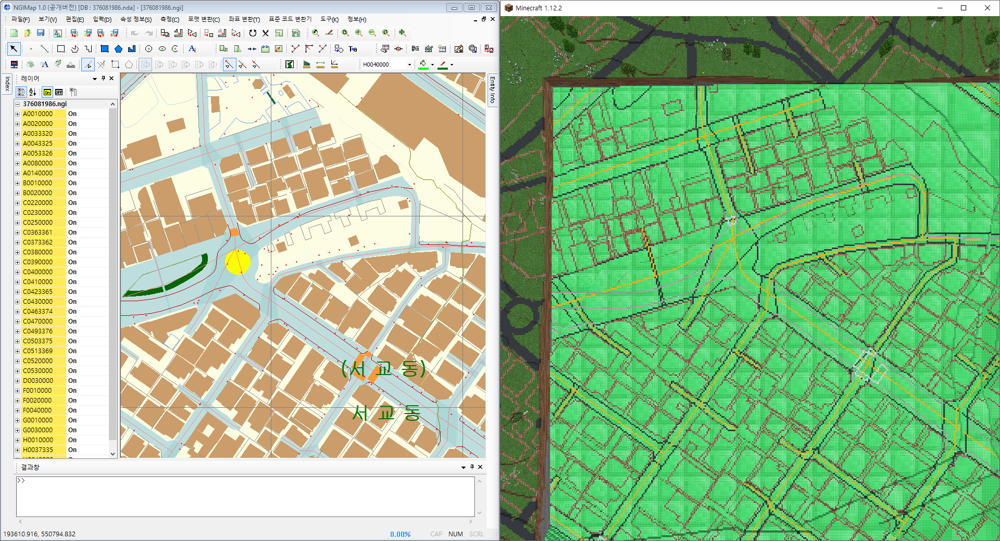

# Suchijido2Minecraft

The mod that imports Korean National Geographic Data Map files (also known as "수치지도" made by [National Geographic Information Institute, 국토지리정보원](https://www.ngii.go.kr/)) to Minecraft via [Terra++](https://www.curseforge.com/minecraft/mc-mods/terraplusplus)'s terrain generating feature.

## Info
### Required mods
 * [Terra++](https://www.curseforge.com/minecraft/mc-mods/terraplusplus)
   * [CubicChunks](https://www.curseforge.com/minecraft/mc-mods/opencubicchunks)
   * [CubicWorldGen](https://www.curseforge.com/minecraft/mc-mods/cubicworldgen)
 * [WorldEdit](https://www.curseforge.com/minecraft/mc-mods/worldedit)

### Supported file types
 - .ngi
   * [Parser Implementation](src/main/java/com/mndk/ngiparser/NgiParser.java)
 - .shp & .dbf
   * [Parser Implementation](src/main/java/com/mndk/shapefile/ShpDbfDataIterator.java)
 - ~~.dxf (Removed)~~

### Terrain generation algorithm
 - Constraint Delaunay Triangulation (CDT)
   * [Original Github source](https://github.com/artem-ogre/CDT)
   * [Implementation](src/main/java/com/mndk/scjd2mc/core/triangulator/cdt/ConstraintDelaunayTriangulator.java)
 - ~~(Deprecated) Fast Delaunay Triangulation (FDT)~~
   * ~~[Original Github source](https://github.com/mapbox/delaunator)~~
   * ~~[Implementation](src/main/java/com/mndk/scjd2mc/core/triangulator/fdt/FastDelaunayTriangulator.java)~~

## Usage
1. Download vector map data files [from Interactive Map Platform of NGII](http://map.ngii.go.kr/ms/map/NlipMap.do), and rename them to something like "37000000.&lt;extension&gt;".
2. Put downloaded files at:
    * Singleplayer: `.../.minecraft/kvecmap_files/`
    * Multiplayer: `/path/to/server/file/kvecmap_files/`
3. Select the region you want the mod to generate with the WorldEdit's wand (wooden axe).
4. Use the command `/gen<extension_name>map <data_file_name> [args]` to import data files. 
   Example: 
    * `/genngimap 37000000.ngi --generate-all`
    * `/genshpzipmap 37000000.zip --layer-only=B0010000`

## Copyright
The vector map data, map format, and triangulation algorithms (CDT, FDT) are copyrighted by their original creators.

## Screenshot

